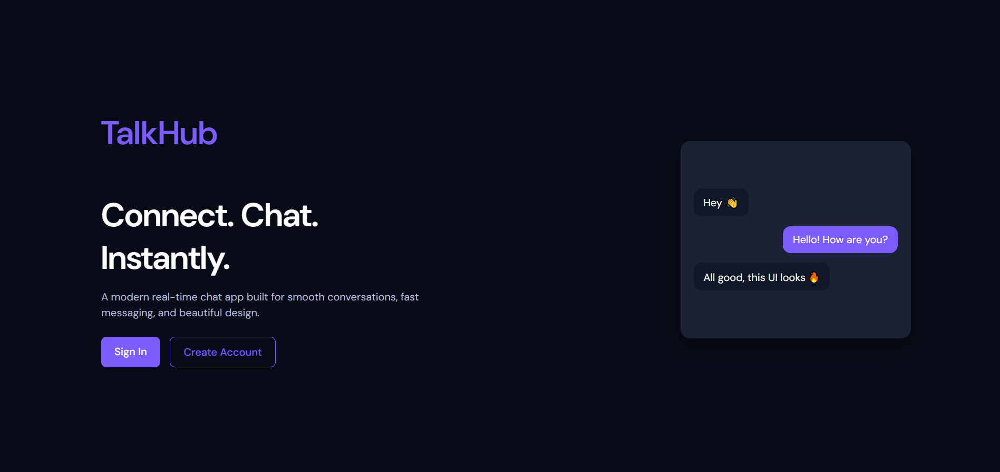
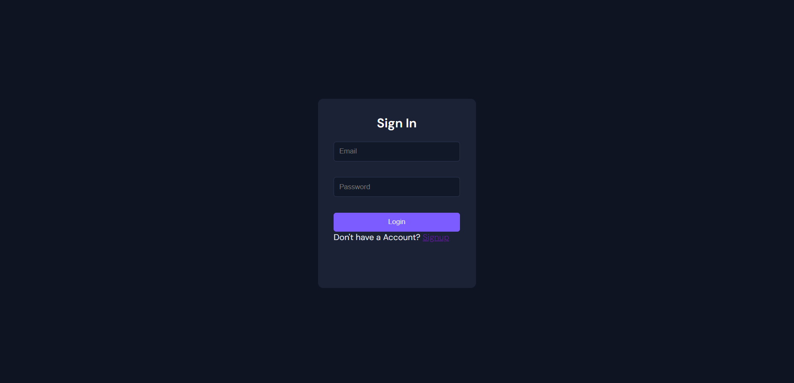
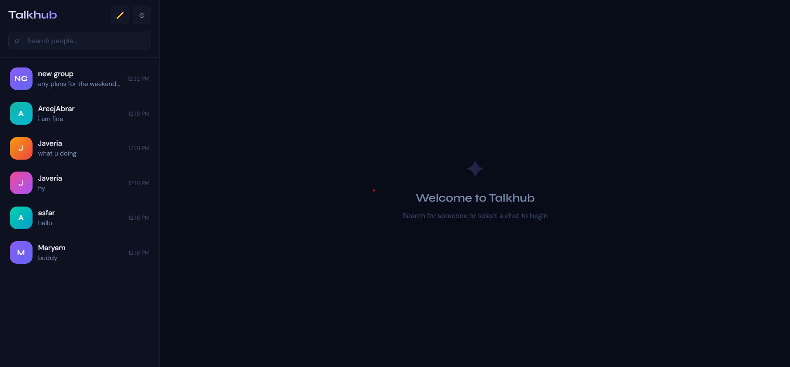
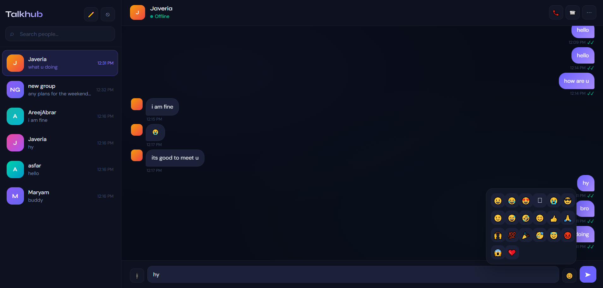

<div align="center">

# 💬 TalkHub

### Real-Time Chat Application using MERN Stack & Socket.IO


</div>

---

## 📖 About The Project

TalkHub is a real-time chat application built using the MERN stack and Socket.IO.  
It allows users to communicate instantly with a fast, responsive, and user-friendly interface.

Built as a learning and portfolio project to demonstrate real-time communication using WebSockets.

---

## ✨ Features

- Real-time messaging
- User authentication
- Typing indicators
- Online/offline user status
- Group chats
- Responsive modern UI
- Secure backend APIs
- Socket.IO integration

---

## 🛠️ Tech Stack

### Frontend
- React.js
- CSS
- Axios

### Backend
- Node.js
- Express.js
- Socket.IO

### Database
- MongoDB

---

## 📸 Screenshots

### 🏠 Home


### 🔐 Login Page


### 💬 Chat Dashboard


### 🟢 Real-Time Messaging


---

## ⚙️ Installation & Setu

### Clone the repository

```bash
git clone https://github.com/Maryam-Abid112/TalkHub.git
```

---

### Backend Setup

```bash
cd backend
npm install
npm start
```

---

### Frontend Setup

```bash
cd frontend
npm install
npm start
```

---

## 🚀 Future Improvements

- File sharing
- Voice & video calling
- Message reactions
- Dark mode

---

## 👩‍💻 Author

### Maryam Abid

- GitHub: https://github.com/Maryam-Abid112
- LinkedIn: https://www.linkedin.com/in/maryam-abid-6272162b7

---